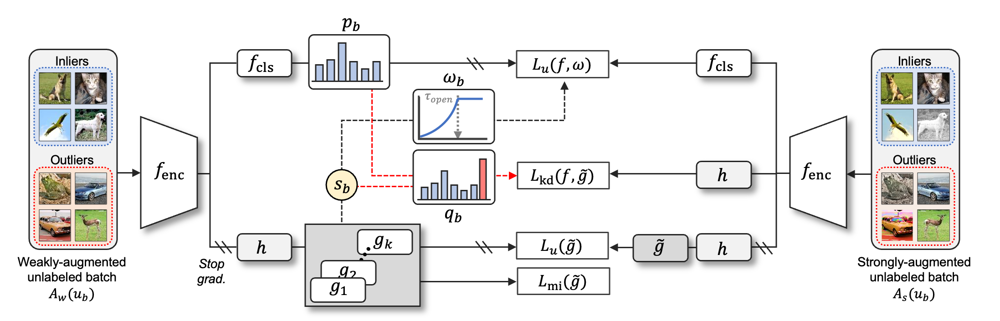
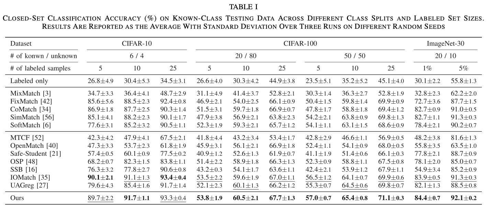
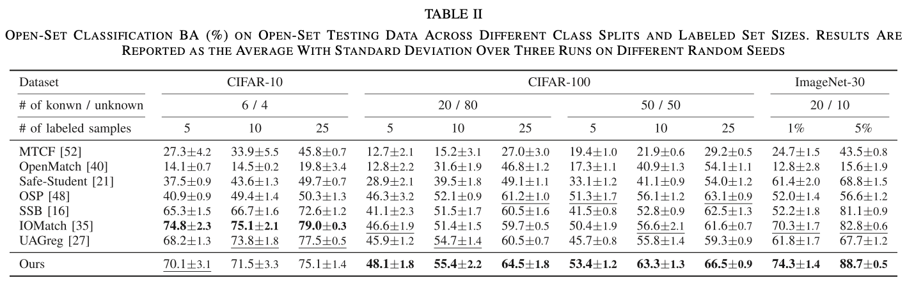

# Diversify and Conquer (DAC) for Open-Set Semi-Supervised Learning

## Introduction

This is an official repository for our **TNNLS 2025** paper:
> **Diversify and Conquer: Open-set Disagreement for Robust Semi-supervised Learning with Outliers**</br>
> Heejo Kong, Sung-Jin Kim, Gunho Jung, Seong-Whan Lee*</br>
[[`Paper (IEEE)`](https://doi.org/10.1109/TNNLS.2025.3547801)] [[`Paper (arXiv)`](https://arxiv.org/abs/2505.24443)] [[`BibTeX`](#citations)]




## Getting Started

This is an example of how to set up DAC locally. We implement DAC using the SSL and Open-set SSL PyTorch benchmarks, [USB](https://github.com/microsoft/Semi-supervised-learning) and [IOMatch](https://github.com/nukezil/IOMatch).

To get a local copy up, running follow these simple example steps.


### Prerequisites

Our open-set SSL benchmark is built on pytorch, with torchvision, torchaudio, and transformers.

To install the required packages, you can create a conda environment:
```sh
conda create --name dac python=3.10
```

then use pip to install required packages:
```sh
pip install -r requirements.txt
```

From now on, you can start use our benchmark by typing
```sh
python train.py --c config/classic_cv/fixmatch/fixmatch_cifar100_50_1250_1.yaml
```

### Dataset Preparation

All datasets are supposed to be under ./data (or create soft links) as follows.
```
DivCon
├── config
    └── ...
├── data
    ├── cifar10
        └── cifar-10-batches-py
    └── cifar100
        └── cifar-100-python
    └── imagenet30
        └── one_class_test
        └── one_class_train
    └── semi-inat-2021
        └── l_train
        └── u_train
        └── test
    └── ood_data
├── semilearn
    └── ...
└── ...
```

The detailed instructions for downloading and processing are shown in Dataset Download. Please follow it to download datasets before running or developing algorithms.

The data For ImageNet-30 and Semi-iNat-2021 can be downloaded from the following repositories, [OpenMatch](https://github.com/VisionLearningGroup/OP_Match) and [semi-inat-2021](https://github.com/cvl-umass/semi-inat-2021). 

The out-of-dataset testing data for extended open-set evaluation can be downloaded in [CSI](https://github.com/alinlab/CSI).


### Development

You can also develop your own open-set SSL algorithm and evaluate it by cloning this repository:
```sh
git clone https://github.com/heejokong/DivCon.git
```


## Usage

We implement [Diversify and Conquer (DAC)](./semilearn/algorithms/dac/dac.py) using the codebase of [USB](https://github.com/microsoft/Semi-supervised-learning).


### Training

Here is an example to train DAC on CIFAR-100 with the seen/unseen split of "50/50" and 25 labels per seen class (i.e., the task CIFAR-50-1250 with 1250 labeled samples in total).
```sh
# seed = 1
CUDA_VISIBLE_DEVICES=0 python train.py --c config/openset_cv/dac/dac_cifar100_50_1250_1.yaml
```

Training DAC on other datasets with different open-set SSL settings can be specified by a config file:
```sh
# CIFAR10, seen/unseen split of 6/4, 25 labels per seen class (CIFAR-6-150), seed = 1
CUDA_VISIBLE_DEVICES=0 python train.py --c config/openset_cv/dac/dac_cifar10_6_150_1.yaml

# CIFAR100, seen/unseen split of 20/80, 25 labels per seen class (CIFAR-20-500), seed = 1
CUDA_VISIBLE_DEVICES=0 python train.py --c config/openset_cv/dac/dac_cifar100_20_500_1.yaml

# ImageNet30, seen/unseen split of 20/10, 5% labeled data (ImageNet-20-p5), seed = 1
CUDA_VISIBLE_DEVICES=0 python train.py --c config/openset_cv/dac/dac_in30_p5_1.yaml
```


### Evaluation

After training, the best checkpoints will be saved in ``./saved_models``. The closed-set performance has been reported in the training logs. For the open-set evaluation, please see [``eval.py``](./eval.py).


## Experimental Results

### Close-Set Classification Accuracy




### Open-Set Classification Accuracy




## Acknowledgments

We sincerely thank the authors of [USB (NeurIPS'22)](https://github.com/microsoft/Semi-supervised-learning) for creating such an awesome SSL benchmark.

We sincerely thank the authors of the following projects for sharing the code of their great works:

- [MTC (ECCV'20)](https://github.com/YU1ut/Multi-Task-Curriculum-Framework-for-Open-Set-SSL)
- [OpenMatch (NeurIPS'21)](https://github.com/VisionLearningGroup/OP_Match)
- [OSP (CVPR'23)](https://github.com/rain305f/OSP)
- [SSB (ICCV'23)](https://github.com/yue-fan/ssb)
- [IOMatch (ICCV'23)](https://github.com/nukezil/IOMatch)


## Citation
```bibtex
@article{kong2025diversify,
  title={Diversify and Conquer: Open-Set Disagreement for Robust Semi-Supervised Learning With Outliers},
  author={Kong, Heejo and Kim, Sung-Jin and Jung, Gunho and Lee, Seong-Whan},
  journal={IEEE Transactions on Neural Networks and Learning Systems},
  year={2025},
  publisher={IEEE}
}
```